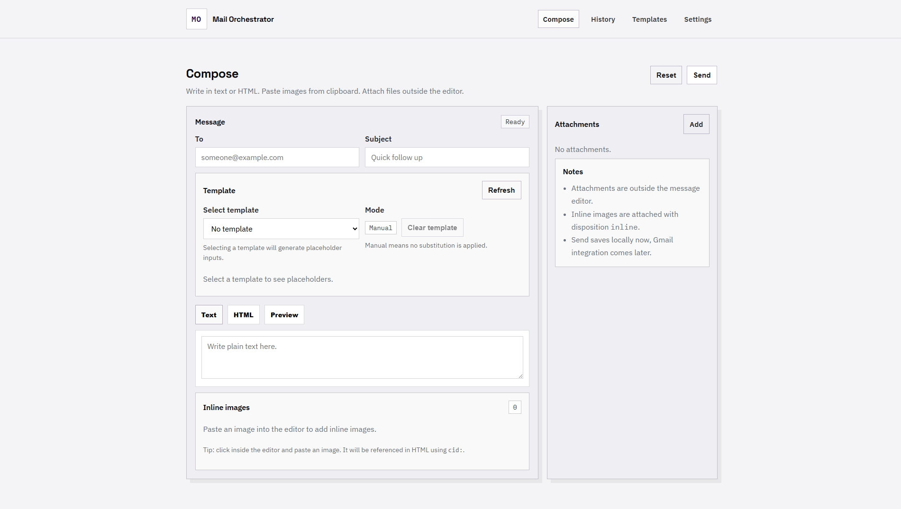

# Mail Orchestrator

[](#)
[](#license)
[](#tech-stack)
[](#tech-stack)
[](#tech-stack)
[](#tech-stack)
[](#tech-stack)
[](#gmail-integration)
[](#contributing)



Local-first email composer and sent mail tracker powered by Gmail.  
Designed as a portfolio-grade project: clean architecture, strong UI identity, and a backend prepared for future deployment.

Repo: `mail-orchestrator`  
Project: **Mail Orchestrator**

---

## Table of contents

- [Why](#why)
- [Core features](#core-features)
- [Product scope](#product-scope)
- [Tech stack](#tech-stack)
- [Architecture](#architecture)
- [Data model](#data-model)
- [API](#api)
- [Editor and formatting](#editor-and-formatting)
- [OAuth credentials](#oauth-credentials)
- [Gmail integration](#gmail-integration)
- [Local-first and security](#local-first-and-security)
- [Development](#development)
- [Roadmap](#roadmap)
- [Project structure](#project-structure)
- [Contributing](#contributing)
- [License](#license)

---

## Known Limitations

See [TECHNICAL_DEBT.md](./TECHNICAL_DEBT.md) for known issues and limitations.

---

## Why

Sending a lot of outreach emails is easy. Tracking what was sent, what got replies, and what should be followed up is where most workflows break.

**Mail Orchestrator** is a local-first tool to:

- compose emails fast with templates
- send via Gmail with proper MIME support
- track sent history with reply detection
- recheck replies anytime
- resend or follow up with intention

---

## Core features

### Compose

- Google login via OAuth
- Compose email with:
  - `To`
  - `Subject`
  - `Message` (Text, HTML, Preview)
  - Attachments (separate from the message editor)
  - Clipboard image paste with inline images support

### History

- Sent items stored locally with:
  - date sent
  - subject
  - recipient
  - relative time (minutes, hours, days)
  - time emoji status: `⚪🔵🟡🔴`
  - replied status: `🟢` (exclusive)
- Manual actions:
  - recheck reply status anytime
  - mark replied manually (for replies outside Gmail)
  - resend an email

### Templates

- Create email templates with unlimited placeholders
- Placeholders are detected automatically
- Selecting a template generates a dynamic form for placeholder values
- Substitution happens on send time

### Settings

- Configure time thresholds for status emojis
- Order is fixed and configurable by minutes:
  - `⚪` newest
  - `🔵` recent
  - `🟡` aging
  - `🔴` stale
- `🟢` is always reserved for replied

---

## Product scope

- Runs **fully locally**
- Backend is designed to be deployment-ready later:
  - migrations
  - clean boundaries
  - environment-based configuration
- Not targeting multi-user or hosted mode in the first iteration

---

## Tech stack

### Backend

- **Python 3.12+**
- **FastAPI** for REST + Swagger
- **SQLite** local database
- **SQLAlchemy** ORM
- **Alembic** migrations

### Frontend

- **HTML + SCSS + Vanilla JS**
- **Vite** dev server and build pipeline

### Tooling

- One-command dev workflow (`npm run dev`)
- Hot reload for frontend and backend
- Auto-open browser on start

---

## Architecture

This repository contains two decoupled apps:

- `frontend/` is a static UI built with vanilla web tech and Vite
- `backend/` is a REST API built with FastAPI

Communication happens through HTTP only.

### High-level flow

1. User logs in with Google OAuth locally
2. User composes an email (text, HTML, attachments, inline images)
3. Backend builds a MIME message and sends via Gmail API
4. Backend stores metadata locally:
   - recipient, subject, sent time
   - Gmail `messageId` and `threadId`
5. History view can be refreshed anytime
6. Reply check fetches Gmail thread and detects incoming replies

---

## Data model

### `emails`

- `id`
- `gmail_message_id`
- `gmail_thread_id`
- `to`
- `subject`
- `body_text`
- `body_html`
- `sent_at`
- `responded`
- `responded_at`
- `responded_source` (`gmail` or `manual`)
- `last_checked_at`

### `email_attachments`

- `email_id`
- `filename`
- `mime_type`
- `size_bytes`
- `storage_path`
- `disposition` (`attachment` or `inline`)
- `content_id` (CID for inline images)

### `templates`

- `name`
- `subject_template`
- `body_text_template`
- `body_html_template`

### `template_placeholders`

- `template_id`
- `key` (example: `{{company}}`)
- `label`
- `order_index`

### `settings`

- `t_white_minutes`
- `t_blue_minutes`
- `t_yellow_minutes`
- `t_red_minutes`

---

## API

FastAPI provides:

- Swagger UI: `/docs`
- OpenAPI spec: `/openapi.json`

### Auth

- `GET /api/auth/status`
- `POST /api/auth/login`
- `GET /api/auth/callback`
- `POST /api/auth/logout`

### Emails

- `POST /api/emails/send`
- `GET /api/emails/history?limit=50&offset=0`
- `POST /api/emails/{id}/resend`
- `POST /api/emails/{id}/check-reply`
- `POST /api/emails/{id}/mark-responded`

### Templates

- `GET /api/templates`
- `POST /api/templates`
- `GET /api/templates/{id}`
- `PUT /api/templates/{id}`
- `DELETE /api/templates/{id}`
- `GET /api/templates/{id}/placeholders`

### Settings

- `GET /api/settings`
- `PUT /api/settings`

---

## Editor and formatting

Mail Orchestrator supports:

- **Text editing**
- **HTML editing**
- **Preview rendering**

Text and HTML remain synchronized:

- Text to HTML: line breaks become `<br>` and are wrapped into paragraphs
- HTML to Text: extracted via DOM parsing and `textContent`

Tradeoff: perfect bidirectional conversion is complex.  
This project prioritizes predictable behavior for outreach and follow-up workflows.

---

## OAuth credentials

This project uses Google OAuth to access the Gmail API in local development.
Real OAuth credentials **must never be committed**.
An example file is provided to guide the setup:

```
backend/secrets/credentials-example.jsonc
```

### How to set up

1. Copy the example file:

```
backend/secrets/credentials-example.jsonc → backend/secrets/credentials.json
```

2. Follow the step-by-step instructions inside the example file to:
   - Create a Google Cloud project
   - Enable the Gmail API
   - Configure the OAuth consent screen
   - Create a **Web application** OAuth client
   - Add the redirect URI:
     ```
     http://localhost:8000/api/auth/callback
     ```

3. Make sure `credentials.json` and `.env` are ignored by git.

---

### Environment variables

Create a `.env` file inside `backend/`:

```
GOOGLE_OAUTH_CLIENT_SECRETS_FILE=./secrets/credentials.json
GOOGLE_OAUTH_TOKEN_FILE=./secrets/token.json
GOOGLE_OAUTH_REDIRECT_URI=http://localhost:8000/api/auth/callback
GOOGLE_OAUTH_SCOPES=https://www.googleapis.com/auth/gmail.send
https://www.googleapis.com/auth/gmail.readonly
```

---

### Verification

After setup:

1. Start the backend
2. Call `POST /api/auth/login`
3. Open the returned `auth_url`
4. Complete Google consent

If successful:

- Google redirects to the backend callback
- A token file is created at: `backend/secrets/token.json`
- `GET /api/auth/status` returns `authenticated: true`

---

## Gmail integration

### Sending

Gmail API supports sending RFC 2822 raw messages via:

- `messages.send`
- `drafts.send`

This enables:

- multipart messages
- text and HTML alternatives
- attachments
- inline images using CID

### Reply detection

The app stores `threadId` and checks replies by fetching the thread and finding a newer message sent by someone else after `sent_at`.

### Inline images

Clipboard pasted images are stored locally and sent as MIME inline parts with a `Content-ID`, referenced in HTML using:

- `cid:some-id`

---

## Local-first and security

- Database is local SQLite
- Attachments are stored locally
- OAuth tokens are stored locally

Planned security approach:

- store tokens in a local file outside version control
- never commit secrets
- `.env` for local configuration
- `.gitignore` for token and DB files

---

## Development

### Prerequisites

* Node 18+
* Python 3.12+
* A Google Cloud project with Gmail API enabled and OAuth credentials

### Run

At repository root:
```bash
npm run dev
```

### Expected behavior

* Starts backend with hot reload
* Starts frontend with hot reload
* Opens the browser automatically

### Environment variables

The backend will require configuration values such as:

* Google OAuth client ID
* Google OAuth client secret
* Redirect URL (localhost)
* Token storage path

These will be fully documented once the OAuth authentication commit is implemented.

### Roadmap

Planned milestones, aligned with commit-driven development:

* Vite frontend scaffold with editorial UI
* FastAPI scaffold with Swagger
* One-command dev workflow
* SQLite + SQLAlchemy + Alembic
* Compose UI and editor tabs
* Clipboard image paste support
* Template CRUD and placeholder parsing
* OAuth login and token storage
* Gmail send with MIME builder
* History list with emoji-based relative time
* Reply detection via thread fetch
* Settings page for emoji thresholds

### Future work

* Follow-up chains per email
* Scheduled follow-ups
* Optional online deployment path
* Multi-account support
* Import existing sent mail into local database

### Project structure
```
mail-orchestrator/
  backend/
    app/
      api/
      core/
      db/
      gmail/
      models/
      schemas/
      services/
    tests/
    pyproject.toml
    alembic.ini
  frontend/
    src/
      assets/
      styles/
      pages/
      components/
    index.html
    vite.config.js
    package.json
  scripts/
    dev.mjs
  README.md
  package.json
```

## Contributing

This project is being built as a learning-focused portfolio repository.

Pull requests are welcome, but the primary workflow is commit-by-commit evolution with strong documentation and architectural intent.

## License

MIT. See [LICENSE](./LICENSE).