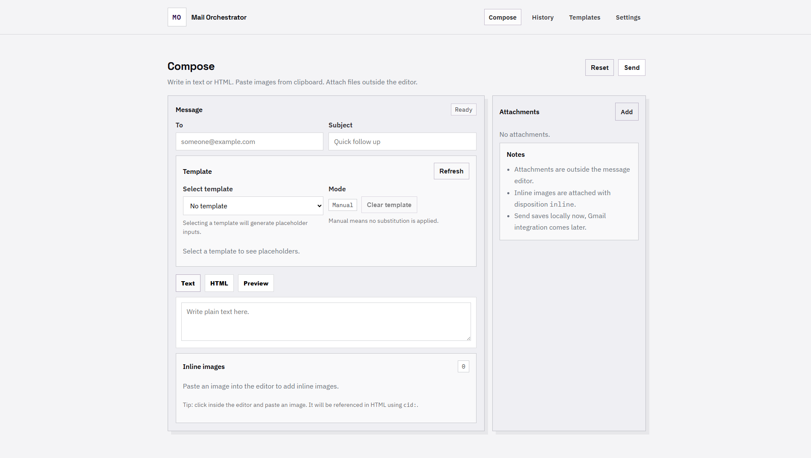

# Mail Orchestrator

[](#license)
[](#tech-stack)
[](#features)



Local-first email composer and sent-mail tracker powered by Gmail. Connect multiple
Gmail accounts and keep each account's history, attachments, templates and settings
separate. The screenshot above predates the account selector.

## Contents

- [Features](#features)
- [Getting started](#getting-started)
- [Multiple Gmail accounts](#multiple-gmail-accounts)
- [Architecture and data](#architecture-and-data)
- [API](#api)
- [Configuration](#configuration)
- [Docker and persistent data](#docker-and-persistent-data)
- [Security and limitations](#security-and-limitations)
- [Tests](#tests)
- [Documentation](#documentation)
- [Roadmap](#roadmap)

## Features

- Connect, switch and reconnect Gmail accounts through Google OAuth.
- Compose text/HTML messages using the visual Editor and Preview tabs.
- Paste inline images and upload regular attachments; send via Gmail with MIME.
- Create account-specific templates with automatically detected placeholders.
  The frontend applies placeholder values before sending.
- Browse account-specific sent history, newest or oldest first, with pagination.
- Recheck replies, mark a response manually, resend or delete local history entries.
- Configure independent time thresholds for ⚪ 🔵 🟡 🔴; 🟢 indicates a response.
- Run locally in development or as two persistent Docker containers.

## Getting started

Configure a Google **Web application** OAuth client with Gmail API enabled and
this exact redirect URI:

```text
http://localhost:8000/api/auth/callback
```

Save the downloaded, valid JSON as `backend/secrets/credentials.json`. The
[annotated example](backend/secrets/credentials-example.jsonc) is a reference,
not a ready-to-use credentials file: JSON comments and placeholder values must
not be copied into the runtime file.

With Docker and the Compose plugin installed, run from the repository root:

```sh
docker compose up -d --build --wait
```

Open [Mail Orchestrator](http://localhost:5173) and select **Open Gmail Login**.
An existing installation should be backed up before starting code that applies
new migrations. See [backup and migration instructions](backend/ACCOUNTS.md).

For development installation on Linux, macOS or Windows, use [SETUP.md](SETUP.md).
Do not run the development backend and Docker backend against the same database
at the same time.

## Multiple Gmail accounts

- **Gmail / sender** selects the account used by the entire workspace.
- **Add / reconnect account** authorizes another Gmail or restores its connection.
- **Continue login in this tab** is available as an alternative to the popup.
- **Disconnect account** removes the account's local credentials and access in
  all browsers. Its saved data remains; reconnecting the same Gmail restores it.
  This does not revoke Google's authorization grant.
- Account selection is per tab. Switching reloads the page after confirmation;
  unsaved edits are discarded.
- A new account starts with empty history and templates, and independent defaults.
  Connecting Gmail does not import existing sent messages from Gmail.

The backend checks both the browser session and the selected account. Filtering
is enforced for reads, edits, deletes, sends and reply checks, not just in the UI.

### Existing data

Migration `b4a81e220001` assigns all pre-existing email, template and settings
records to `srcaetite@gmail.com`, as confirmed by the repository owner. Existing
attachment and placeholder relationships are preserved.

Log in again with that Gmail after upgrading. The old `secrets/token.json` is
preserved but no longer used for authentication. This migration has a
repository-specific owner; it is not an automatic account-discovery migration
for unrelated installations. See [ACCOUNTS.md](backend/ACCOUNTS.md).

## Architecture and data

### Tech stack

- Backend: Python 3.12+, FastAPI, Pydantic, SQLAlchemy, Alembic and SQLite.
- Gmail integration: Google Auth libraries, Gmail API and Python MIME support.
- Credential encryption: Fernet from `cryptography`.
- Frontend: vanilla JavaScript, HTML, SCSS and Vite.
- Docker: Python backend plus Nginx serving the production frontend build.

The frontend calls the API with an HttpOnly session cookie and `X-Account-ID`.
The authorized account is bound to the request's database session; service
queries filter ownership and Gmail clients load that account's credentials.

| Tables | Purpose and ownership |
| --- | --- |
| `accounts` | Unique Gmail address and encrypted Google credentials |
| `browser_sessions` | Hashed browser-session identifier and expiry |
| `session_accounts` | Accounts authorized in each browser session |
| `oauth_attempts` | One-time state, encrypted PKCE verifier and expiry |
| `emails` | Owner `account_id`, bodies, Gmail IDs, send count and reply status |
| `email_attachments` | Files and inline-image metadata owned through `email_id` |
| `templates` | Owner `account_id`, name, subject and body templates |
| `template_placeholders` | Fields owned through `template_id` |
| `settings` | One independent threshold configuration per `account_id` |

A send uploads files, builds MIME, sends through the selected Gmail and then
stores local history. A resend updates the original record, send count and latest
Gmail IDs. Reply checks inspect the stored thread using the same owning account.

## API

[Swagger](http://localhost:8000/docs) and [OpenAPI](http://localhost:8000/openapi.json)
describe request/response bodies. Account headers are read by a dependency and
are not declared as a Swagger authorization scheme.

Protected data routes require the `mo_session` cookie and `X-Account-ID`.
Mutating requests also require `Origin` equal to `FRONTEND_ORIGIN`. A header
alone cannot authorize access to an account. Browser requests use
`credentials: "include"`.

| Method | Path | Purpose |
| --- | --- | --- |
| GET / HEAD | `/api/health` | Public health check |
| GET | `/api/auth/status` | Connected accounts for this browser; no Google tokens returned |
| POST | `/api/auth/login` | Start browser-bound OAuth; requires trusted Origin |
| GET | `/api/auth/callback` | Consume state/code and redirect to the frontend |
| POST | `/api/auth/logout` | Disconnect the selected account, retaining data |
| GET | `/api/gmail/profile` | Selected account's Gmail profile |
| POST | `/api/emails/send` | JSON send without attachments |
| POST | `/api/emails/send-multipart` | Send with regular files and inline images |
| GET | `/api/emails/history` | `limit`, `offset`, `sort=recent\|oldest` |
| POST | `/api/emails/{id}/resend` | Resend an owned record |
| POST | `/api/emails/{id}/check-reply` | Check its latest Gmail thread |
| POST | `/api/emails/{id}/mark-responded` | Set manual response state |
| DELETE | `/api/emails/{id}` | Delete local email and attachment records, not the Gmail message |
| GET / POST | `/api/templates` | List/create templates |
| GET / PUT / DELETE | `/api/templates/{id}` | Read/update/delete an owned template |
| GET | `/api/templates/{id}/placeholders` | List detected fields |
| GET / PUT | `/api/settings` | Read/update selected account's thresholds |

JSON requests with attachments are rejected: use multipart uploads rather than
server filesystem paths. An owned-resource lookup with another account's ID
returns 404; an account not authorized in the session is rejected.

## Configuration

Use [backend/.env.example](backend/.env.example) for local development.

| Variable | Default / role |
| --- | --- |
| `DATABASE_URL` | `sqlite:///./data/mail_orchestrator.db`, relative to the backend working directory |
| `GOOGLE_OAUTH_CLIENT_SECRETS_FILE` | `./secrets/credentials.json` |
| `GOOGLE_OAUTH_REDIRECT_URI` | `http://localhost:8000/api/auth/callback` |
| `GOOGLE_OAUTH_SCOPES` | Space-separated `gmail.send` and `gmail.readonly` URLs |
| `FRONTEND_ORIGIN` | `http://localhost:5173`; CORS and mutation Origin validation |
| `ACCOUNT_TOKEN_KEY_FILE` | Defaults to `account-token.key` beside the legacy token path |
| `GOOGLE_OAUTH_TOKEN_FILE` | Legacy path `./secrets/token.json`; only helps determine the default key location |
| `VITE_API_BASE` | Frontend variable, default `http://localhost:8000` |

Keep `GOOGLE_OAUTH_SCOPES` on one line. `VITE_API_BASE` is consumed by Vite at
development/build time, not by Nginx at runtime. The stock Dockerfile does not
expose it as a build argument. Backend `.env` is excluded from the Docker image;
custom Docker settings must be supplied through Compose environment configuration.

## Docker and persistent data

| Data | Host path | Container path |
| --- | --- | --- |
| SQLite data, encrypted tokens and sessions | `backend/data/` | `/data` |
| OAuth client JSON, encryption key and legacy token | `backend/secrets/` | `/app/secrets` |
| Uploaded files | `backend/storage/` | `/app/storage` |

New uploads go into `storage/uploads/<account_id>/` with unique filenames.
Legacy uploads stay at their original paths. Container rebuilds, restarts and
`docker compose down` preserve these bind-mounted directories.

```sh
docker compose ps
docker compose logs -f
docker compose restart
docker compose stop
docker compose start
# Back up before activating schema changes:
docker compose up -d --build --wait
```

Migrations run automatically before the backend starts. Both services use
`restart: unless-stopped`; automatic return after reboot also requires the
Docker daemon to start.

See [ACCOUNTS.md](backend/ACCOUNTS.md) for routine backup, the one-time legacy
migration rehearsal and rollback precautions. Never delete persistent folders
to troubleshoot a login problem.

## Security and limitations

- Google credentials are encrypted in SQLite; the key is stored separately with
  mode 0600. Email bodies, attachments, settings and backup archives are not
  encrypted by this application.
- Keep the database, encryption key and attachments together in a protected backup.
  Do not commit/share runtime credentials, keys, sessions or backups.
- Browser sessions last 30 days; OAuth attempts expire after 10 minutes. A listed
  account can still need reauthorization if Google access expires or is revoked.
- This is a local-first application, not a hardened public multi-tenant service.
  The default Compose port mappings bind to host interfaces, not only loopback;
  review network access before using it on an untrusted network.
- See [TECHNICAL_DEBT.md](TECHNICAL_DEBT.md) for resend tracking, file cleanup,
  unsaved drafts and deployment limitations.

## Tests

From `backend/`, with its virtual environment active:

```sh
python -m pip install -e '.[test]'
python -m unittest discover -s tests -v
```

From the repository root:

```sh
npm --prefix frontend run build
```

The backend suite covers migration preservation, account isolation and mocked
OAuth/Gmail operations. No real email is sent. The separate
[browser fixture](frontend/README.md#isolated-browser-testing) uses disposable data.

## Documentation

- [Setup](SETUP.md): first installation and troubleshooting.
- [Product and architecture](ABOUT.md).
- [Backend quick start](backend/README.md) and [developer guide](backend/GUIDE.md).
- [Accounts, backups and migration](backend/ACCOUNTS.md).
- [Frontend guide](frontend/README.md).
- [Development journey](JOURNEY.md).
- [Known limitations](TECHNICAL_DEBT.md).

## Roadmap

Implemented: composer, inline images, template CRUD, Gmail send, reply checks,
history sorting, per-account settings, multiple accounts, persistent Docker
deployment and migration/isolation tests.

Future work: follow-up chains, scheduled sending, importing sent mail, richer
resend history and a hardened online deployment path.

## Contributing

This is a learning-focused portfolio project. Preserve existing data, maintain
account isolation in every new route/service and add regression tests for changes.

## License

MIT. See [LICENSE](LICENSE).
